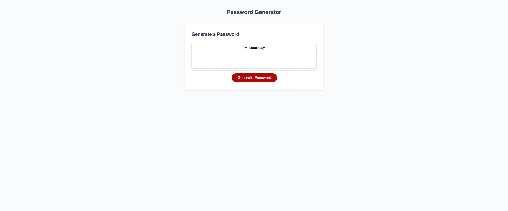

## Table of contents
​
- [Overview](#overview)
  - [Description](#description)
  - [Screenshot](#screenshot)
  - [Links](#links)
- [My process](#my-process)
  - [Built with](#built-with)

​
​## Overview
​
### Description
​
This week's challenge was to build a password generator by having prompts to collecting user criteria (e.g., length of password, lowercase, uppercase, numbers, and special characters). In addition, we had to set parameters within our JS code to ensure that the user was providing the right criteria to generate a password. 
​
​
### Screenshot
​

​
​
### Links
​
- GitHub URL: [https://github.com/hong-f/password-generator-js]
- Live Site URL: [https://hong-f.github.io/password-generator-js/]
​
## My process
I first played around with the existing code to understand how things were connected to one another. Through that, I saw that I had to define the generatePassword() function. I learned that this is where the password would be displayed in the box. 

From there, I started psuedo coding to outline what I thought would be needed to build the random password generator. Which was to define the var arrays/declaration, define the generatePassword() function by husing if/else statements to put in place conditions, how I'll need an array of characters based on user criteria, and finally how I'll need to randomize them to generate a random password.
​
### Built with
​
- JS
​
​